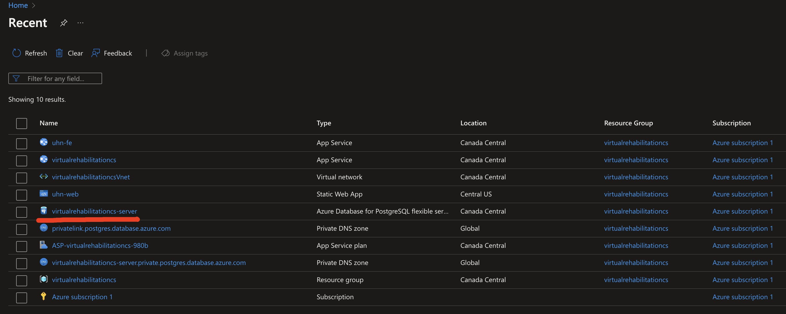
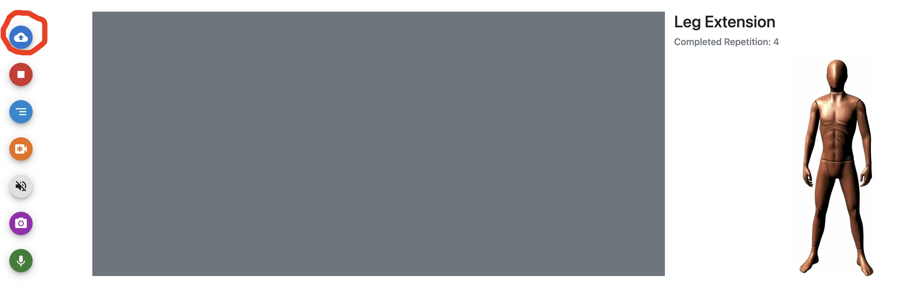
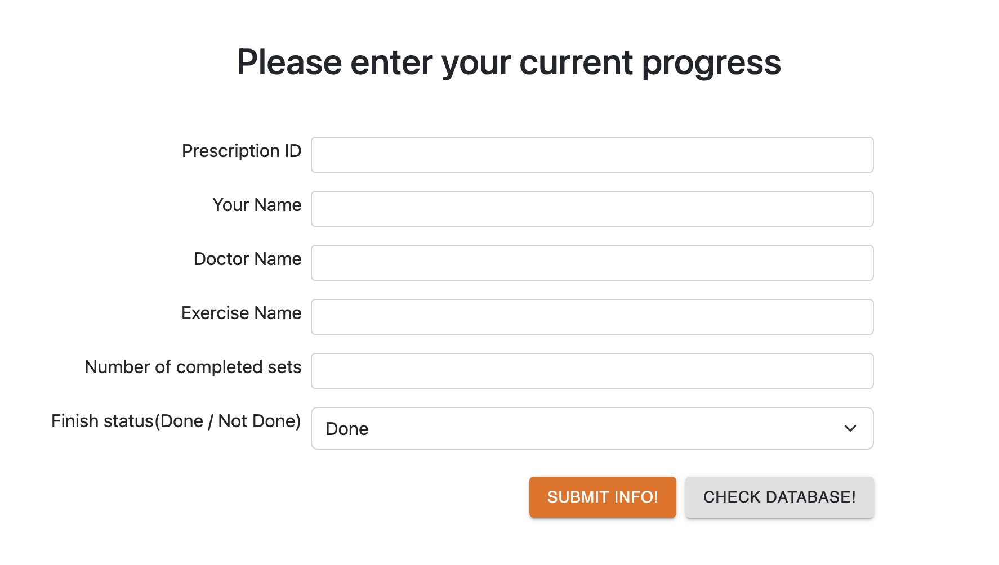
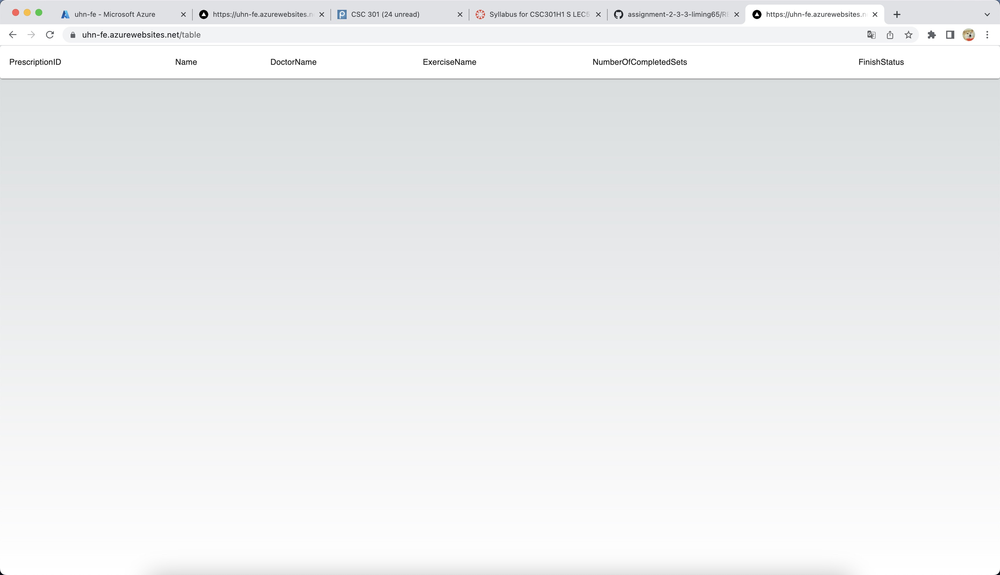
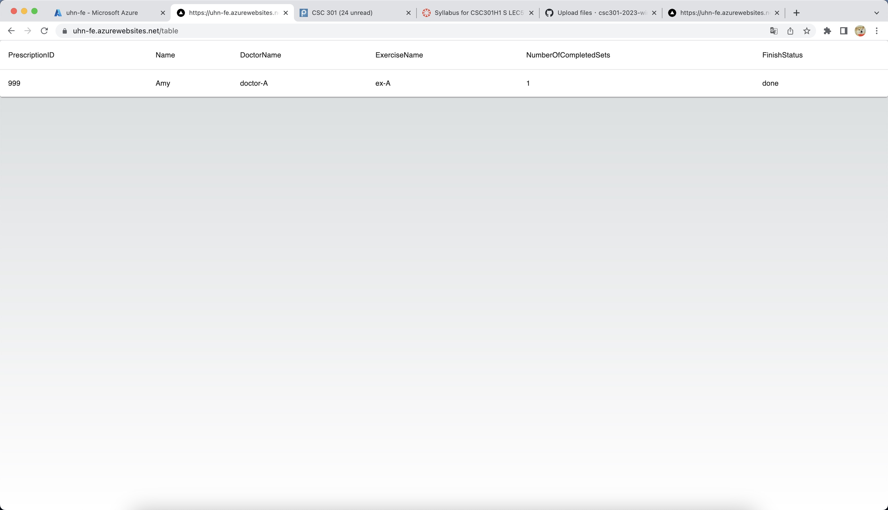

# assignment-2-3-3-liming65-zhangc56
assignment-2-3-3-liming65 created by GitHub Classroom
# Assignment  Details
Click the URL below to see how the database works without downloading the code and setting up enviroment:

[UHN-FE Website](https://uhn-fe.azurewebsites.net)

- I uesd the postgreSQL server on Azure
## 

# Language used
- Boostrap, mui is the style framework
- React js and Next js will be used to develop the front end
- Node js on Azure is the backend
- PostgreSQL will be the database on Azure

# Summary of decisions on database part
I am working on the database part and I am going to set up postgreSQL database on Azure, as it is the required cloud platform from our partner. For now I am just going to make a simple schema and the purpose is to make sure users can type their "exercise progress information"，they will be able to save the info in the database and view the info from the database.
The schema wil be: 
- User_progress(PrescriptionID,YourName,DoctorName,ExerciseName, NumberOfCompletedSets, FinishStatus)

In order to visualize the database running on azure, I designed three simple ui interfaces. Users can "view" the database and add new data to the database without downloading code.In the future I will add more schema to the database and the database will be able to "delete" and "modify" the data.

# Individual Contribution
Mingyang(Nathan) Li: make simple UI for demo purpose, deploy database on Azure.

# All the details and instructions for TA to see and verify the work
Scenario: Alice is 68 years old and just recovered from the coronary heart disease.  She wants  to have access to a virtual rehabilitation program that allows her  to save her  progress and easily resume where she left off. Thus, she can make steady progress towards recovery without feeling overwhelme.

# page 1
By clicking the URL, the first page you will see is a static web page, only one button can be clicked, the purpose of this page is to provide users a link button to access to the data submit page, which is the "exercise progress information"

## 

# page 2
This page is a page for users to interact with the database, the purpose of this page is to allow users to enter information and after clicking submit the data will be stored in the database, and users are able to see the update of the database.
This is for the schema: 
- User_progress(PrescriptionID,YourName,DoctorName,ExerciseName, NumberOfCompletedSets, FinishStatus)

## 

# page 3(testing)
This page shows the content of the database, the purpose of this page is for user to test if their data has been deployed on database, and that's everything! Over all, we make an UI for user to be able to "save" and "check" data to the Azure cloud database.

# page 2 to 3 (step 1)
## 
# page 2 to 3 (step 2)
## 
# page 2 to 3 (step 3)
## 
